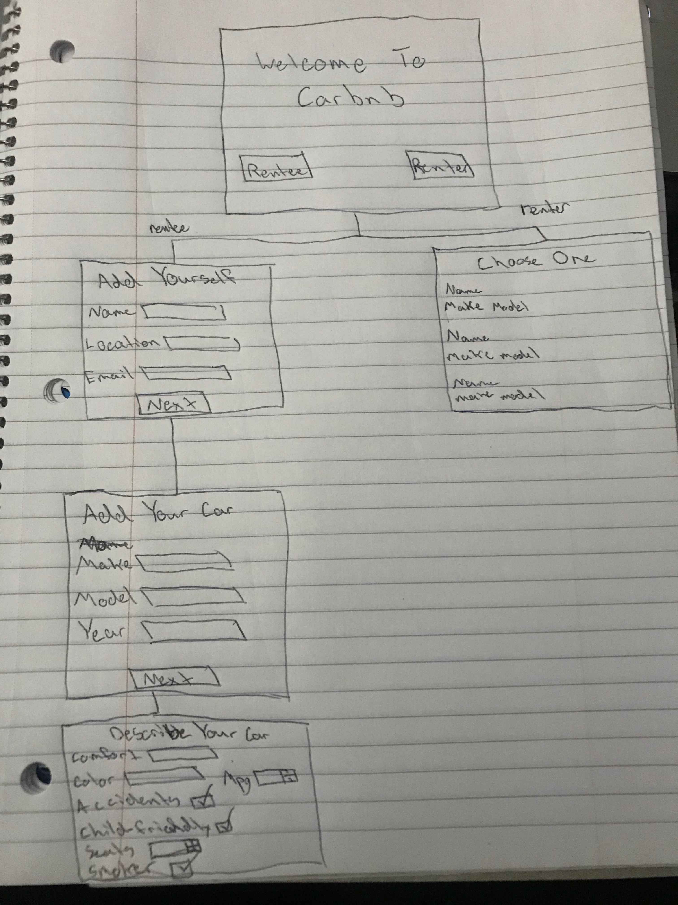
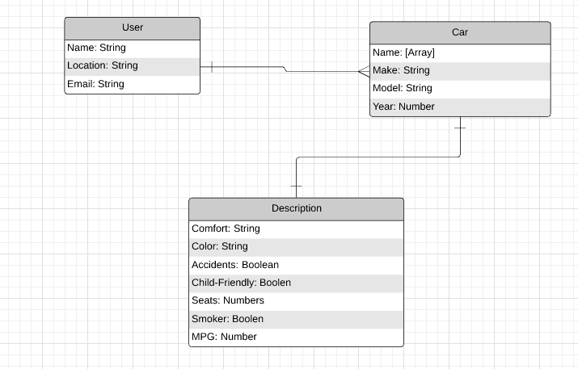

# Project 2 - CarRnD

## Overview

CarRnD is an online application that is similar to the popular vacation rental application Airbnb.
The difference between Carbnb and Airbnb is simply instead of renting homes and venues, you are renting 
a car for your own creative use.

# Links

[Project Board](https://github.com/justinparrish/project-two-carrnd/projects/1?add_cards_query=is%3Aopen "GitHub Project Board")

[Heroku](https://carrnd-rentacar.herokuapp.com/user "CarRnD Link")
# Technologies Used

* MongoDB
* Mongoose
* Handlebars
* Express
* Javascript
* CSS
* Heroku
* GitHub Project Board

# Wire Frames

# ERD

project-board-link: https://github.com/justinparrish/project-two-carrnd/projects/1?add_cards_query=is%3Aopen
heroku-link: https://carrnd-rentacar.herokuapp.com/user
