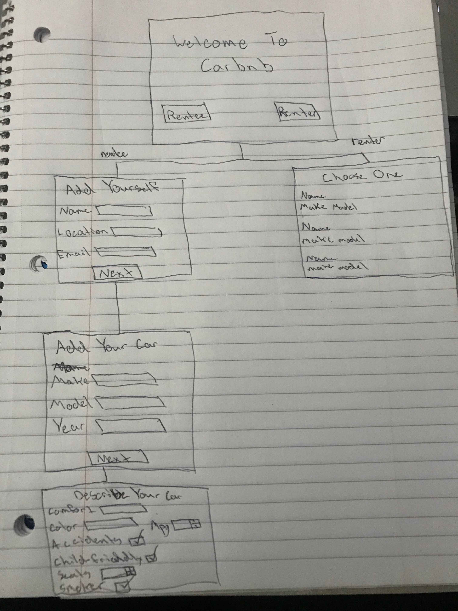
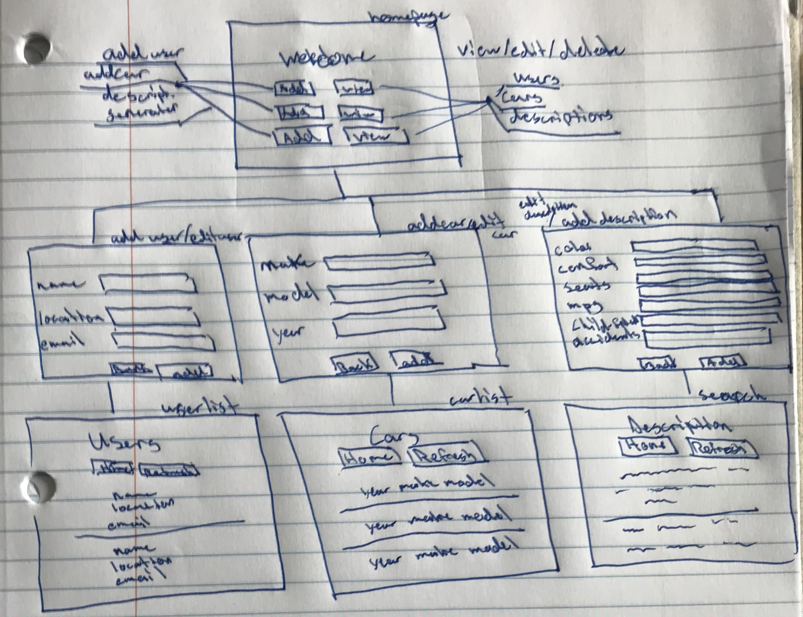
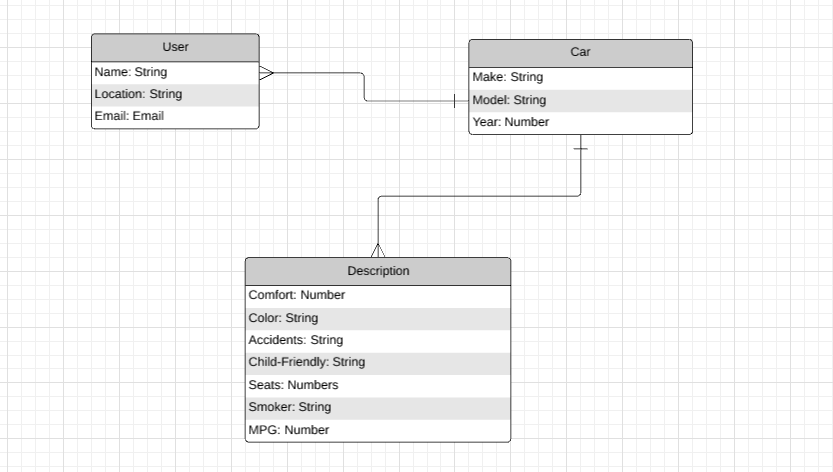

# Project 2 - Fun of Cars

## Overview

<!-- CarRnD is an online application that is similar to the popular vacation rental application Airbnb.
The difference between Carbnb and Airbnb is simply instead of renting homes and venues, you are renting 
a car for your own creative use. -->
Fun of Cars is an online/mobile application that can serve multiple purposes. You can communicate with other individuals via email, as well as show off your car anonymously. Even if you want to sell your car or advertise it, we will generate an eye catching description for you and only you.

## Links

[Project Board](https://github.com/justinparrish/project-two-carrnd/projects/1?add_cards_query=is%3Aopen "GitHub Project Board")

[Heroku](https://carrnd-rentacar.herokuapp.com/user "CarRnD Link")

## Technologies Used

* MongoDB
* Mongoose
* Handlebars
* Express
* Javascript
* CSS
* Heroku
* GitHub Project Board

## Wire Frames

## ERD

## Used Resources
[QuackIt FlexBox Forms](https://www.quackit.com/html/html_editors/scratchpad/?example=/css/flexbox/tutorial/align_form_elements_with_flexbox_example_2 "used for forms")

### Raw Links
project-board-link: https://github.com/justinparrish/project-two-carrnd/projects/1?add_cards_query=is%3Aopen

heroku-link: https://carrnd-rentacar.herokuapp.com/user
